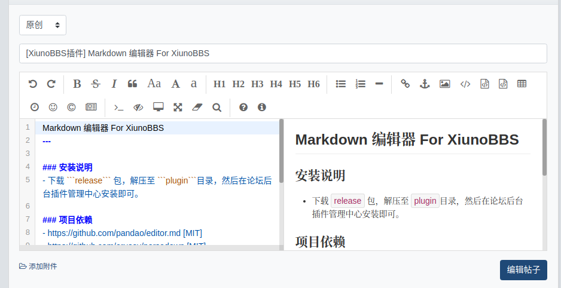

Markdown 编辑器 For XiunoBBS
---

### 安装说明
- 下载 ```release``` 包，解压至 ```plugin```目录，然后在论坛后台插件管理中心安装即可。

**预览图**   


### 项目依赖
- https://github.com/pandao/editor.md [MIT]
- https://github.com/erusev/parsedown [MIT]

### 项目地址
- https://github.com/xiulab/xl_editormd
- https://gitee.com/xiulab/xl_editormd

## License
本项目遵循 [MIT 开源协议](LICENSE).
